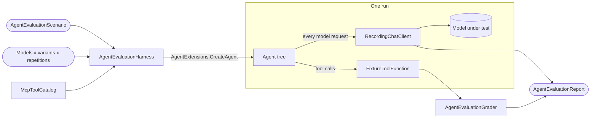

# CasCap.Common.AI.Evaluation

Evaluation harness for [Microsoft Agent Framework](https://github.com/microsoft/agent-framework) agents built
with [CasCap.Common.AI](../CasCap.Common.AI/README.md). It asks an application's real agents realistic
questions across a matrix of models, instruction variants and MCP tool-surface variants, and reports
accuracy, latency, token usage, throttling and visible thinking with the statistics a probabilistic system needs.

## Purpose

Hosted evaluation services cannot target a model on your own hardware, and they do not exercise your
agent factory, tool filters or delegation. This library runs the production agent pipeline instead, so
an edge small language model and a frontier cloud model are measured on identical terms:

- **Real surface, synthetic state.** Tools keep their production names, descriptions and JSON schemas.
  The scenario supplies their responses through the real return types, so the ground truth is known
  and runs are repeatable.
- **Nothing reaches a real system.** Query tools return fixtures; side-effect tools are recorded and
  answered with a sandbox acknowledgement, and calling one fails the run unless the scenario allows it.
- **Delegation is real.** Every agent in the tree is rebuilt against the model under test, so an
  orchestrator's hand-off and the sub-agent's own tool calls are both measured.
- **Every request is recorded:** duration, message count, instruction and tool-schema size, prompt,
  cached, output and reasoning tokens, visible thinking, and Azure SDK throttling.
- **Variants are first-class.** Rewrite instructions across the tree, rewrite tool or parameter
  descriptions, hide tools, allowlist an agent's tools, or add a candidate tool before implementing it.
- **Results are statistics.** Pass counts carry 95% Wilson intervals, and a session summary compares
  every model's speed with a reference model.

The library has no test-framework dependency; the consuming test project decides what to assert.

## Data Flow



## Types

| Type | Kind | Purpose |
| --- | --- | --- |
| [AgentEvaluationHarness](Services/AgentEvaluationHarness.cs) | Service | Builds and runs agent trees against a model, warms models up, lists offered tools, checks provider availability |
| [McpToolCatalog](Services/McpToolCatalog.cs) | Service | Reproduces an agent's tool surface from `AgentConfig.Tools`; classifies tools as query, side effect or delegation |
| [FixtureToolFunction](Services/FixtureToolFunction.cs) | Service | Keeps a tool's real schema, returns fixtures, sandboxes side effects, records calls |
| [RecordingChatClient](Services/RecordingChatClient.cs) | Service | Records every model request and counts visible thinking |
| [AzureThrottlingMonitor](Services/AzureThrottlingMonitor.cs) | Service | Counts HTTP 429 responses and retries hidden by the Azure SDK |
| [EvaluationRecorder](Services/EvaluationRecorder.cs) | Service | Collects one run's tool calls and requests |
| [AgentEvaluationScenario](Models/AgentEvaluationScenario.cs) | Model | Question, target agent, fixtures, required and forbidden tools, answer check, variants |
| [AnswerExpectation](Models/AnswerExpectation.cs) | Model | Deterministic answer checks: numbers (digits or words), phrases, anchored patterns, combinations |
| [InstructionVariant](Models/InstructionVariant.cs) / [ToolSurfaceVariant](Models/ToolSurfaceVariant.cs) | Model | Named instruction and tool-surface changes compared with the baseline |
| [AgentEvaluationConfig](Models/_AgentEvaluationConfig.cs) | Model | Model matrix, repetitions, thresholds, timeouts and switches, bound from `CasCap:AgentEvaluationConfig` |
| [AgentEvaluationRun](Models/AgentEvaluationRun.cs), [AgentEvaluationSummary](Models/AgentEvaluationSummary.cs), [AgentEvaluationProviderSummary](Models/AgentEvaluationProviderSummary.cs) | Model | Per-run results, per-cell and per-model aggregates |
| [AgentEvaluationGrader](Extensions/AgentEvaluationGrader.cs) | Static | Answer, required-tool, forbidden-tool and side-effect checks |
| [AgentEvaluationReport](Extensions/AgentEvaluationReport.cs) | Static | Wilson intervals, Markdown tables, request timelines, JSON Lines and session summaries |
| [ToolFootprint](Extensions/ToolFootprint.cs) | Static | Characters and approximate tokens a tool surface adds to every request |
| [McpPromptContract](Extensions/McpPromptContract.cs) | Static | Finds MCP prompts that name tools which do not exist |

## Usage

```csharp
var catalog = McpToolCatalog.FromAssemblies(typeof(MyOrderMcpQueryService).Assembly);
using var throttling = new AzureThrottlingMonitor();
var harness = new AgentEvaluationHarness(loggerFactory, aiConfig, catalog,
    instructionsAssembly: typeof(MyOrderMcpQueryService).Assembly,
    tokenCredential: credential, config: evaluationConfig, throttlingMonitor: throttling);

var scenario = new AgentEvaluationScenario
{
    Id = "order-status",
    AgentKey = "OrderAgent",
    Question = "Has order 42 shipped?",
    Answer = AnswerExpectation.Matches(@"order 42 (?:has|is) shipped", "says order 42 shipped"),
    RequiredToolGroups = [["get_order_status"]],
    ToolResponses = new Dictionary<string, Func<AIFunctionArguments, object?>>
    {
        ["get_order_status"] = _ => new OrderStatus { OrderId = "42", Status = "Shipped" },
    },
};

var runs = new List<AgentEvaluationRun>();
foreach (var providerKey in evaluationConfig.ProviderKeys)
{
    await harness.WarmUpAsync(providerKey, TimeSpan.FromMinutes(30), cancellationToken);
    for (var repetition = 1; repetition <= evaluationConfig.Repetitions; repetition++)
        runs.Add(await harness.RunAsync(scenario, providerKey, InstructionVariant.Baseline,
            ToolSurfaceVariant.Baseline, repetition, TimeSpan.FromMinutes(5), cancellationToken));
}

var directory = await AgentEvaluationReport.WriteAsync(evaluationConfig.ResultsDirectory, scenario.Id, runs, cancellationToken);
var comparison = await AgentEvaluationReport.WriteSessionSummaryAsync(directory,
    evaluationConfig.ReferenceProviderKey ?? evaluationConfig.ProviderKeys[0], cancellationToken);
```

Run scenarios sequentially: a shared model server and the process-wide throttling monitor both assume
one run at a time.

## Configuration

Bound from `CasCap:AgentEvaluationConfig`. Keep provider endpoints in gitignored local configuration.

| Setting | Default | Meaning |
| --- | --- | --- |
| `ProviderKeys` | empty | Keys into `CasCap:AIConfig:Providers` to evaluate; the consumer chooses a fallback |
| `Repetitions` | `3` | Runs per model and variant combination |
| `InstructionVariants` | all | Variant names to include besides the baseline |
| `ToolSurfaceVariants` | all | Variant names to include besides the baseline |
| `MinimumPassRate` | `0.5` | Baseline pass rate a consumer may assert |
| `RunTimeoutSeconds` | `300` | Limit for one run, including delegation |
| `WarmUpTimeoutSeconds` | `1800` | Limit for the unmeasured request that loads each model |
| `ResultsDirectory` | `TestResults/AgentEvaluation` | Root of the per-session results folder |
| `ProviderReasoningEffortApplied` | `false` | Sends each provider's `ReasoningEffort` with every request |
| `EndpointToolsMapped` | `false` | Offers `Endpoint` tool sources, mapped onto in-process tools of the same names |
| `ReferenceProviderKey` | first provider | Model the speed comparison is relative to |

## Configuration Examples

Minimal — one model, defaults for everything else:

```json
{
  "CasCap": {
    "AgentEvaluationConfig": {
      "ProviderKeys": [ "Edge" ]
    }
  }
}
```

Full — an edge model compared with two cloud deployments, with every switch set:

```json
{
  "CasCap": {
    "AIConfig": {
      "Providers": {
        "Edge": { "Type": "OpenAI", "Endpoint": "https://llm.example.com", "ModelName": "example-edge-model", "ApiKey": "none" },
        "CloudMini": { "Type": "AzureOpenAI", "Endpoint": "https://example.openai.azure.com/", "ModelName": "example-mini-deployment" },
        "CloudFlagship": { "Type": "AzureOpenAI", "Endpoint": "https://example.openai.azure.com/", "ModelName": "example-flagship-deployment" }
      }
    },
    "AgentEvaluationConfig": {
      "ProviderKeys": [ "Edge", "CloudMini", "CloudFlagship" ],
      "ReferenceProviderKey": "Edge",
      "Repetitions": 5,
      "InstructionVariants": [ "answer-directly" ],
      "ToolSurfaceVariants": [],
      "MinimumPassRate": 0.6,
      "RunTimeoutSeconds": 300,
      "WarmUpTimeoutSeconds": 1800,
      "ResultsDirectory": "TestResults/AgentEvaluation",
      "ProviderReasoningEffortApplied": false,
      "EndpointToolsMapped": false
    }
  }
}
```

## Results

Each session writes a timestamped folder under `ResultsDirectory`:

| File | Content |
| --- | --- |
| `<scenario>.runs.jsonl` | One JSON line per run: answer, verdicts, tool calls, request timeline, throttling |
| `<scenario>.summary.md` | Pass rates, latency and tokens per model and variant, then every request timeline |
| `chat.jsonl` | Tool-free request durations appended by `AppendPlainChatAsync` |
| `session.summary.md` | Every model across all scenarios so far, with speed relative to the reference model |

## Dependencies

| Dependency | Purpose |
| --- | --- |
| [CasCap.Common.AI](../CasCap.Common.AI/README.md) | Agent factory, tool resolution, run results; brings Microsoft Agent Framework, Microsoft.Extensions.AI, Azure OpenAI and the MCP SDK |

## License

This project is released under [The Unlicense](../../LICENSE).
