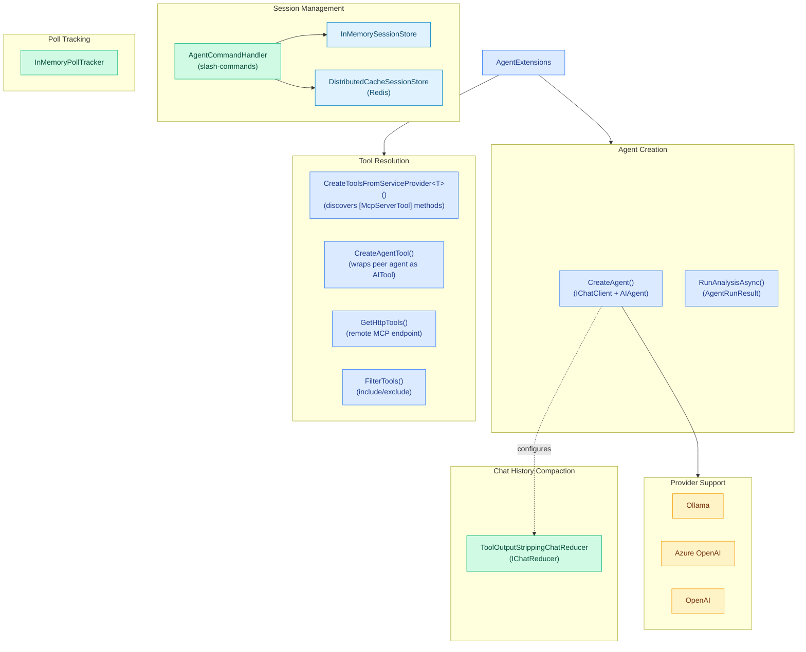

# CasCap.Common.AI

AI agent framework infrastructure — agent creation, session management, MCP tool/prompt resolution, chat history compaction, and slash-command handling.

## Purpose

Provides the shared infrastructure for building multi-agent AI systems with support for multiple providers (Azure OpenAI, OpenAI, Ollama), automatic MCP tool discovery from `[McpServerTool]`-decorated service types, sub-agent delegation (fan-out pattern), persistent session state, and context-window compaction for edge GPU devices.

This library contains **no domain-specific MCP query services** — those live in downstream consumer projects. It provides the framework that consumer projects use to wire agents, tools, sessions, and prompts together.

**Target frameworks:** `net10.0`

### Services

| Type | Description |
| --- | --- |
| `AgentCommandHandler` | Shared handler for `ChatCommand` slash-commands (`/session info`, `/session reset`, `/model`, etc.) and agent session persistence |
| `ToolOutputStrippingChatReducer` | `IChatReducer` that strips `FunctionCallContent`/`FunctionResultContent` from older messages while retaining a sliding window of recent exchanges — critical for reducing context size on edge devices |
| `InMemorySessionStore` | Volatile in-memory `ISessionStore` backed by `ConcurrentDictionary` |
| `DistributedCacheSessionStore` | Redis-backed `ISessionStore` wrapping `IDistributedCache` with sliding expiry |
| `InMemoryPollTracker` | In-memory `IPollTracker` with automatic TTL-based expiry for agent-created polls |

### Abstractions

| Interface | Description |
| --- | --- |
| `ISessionStore` | Persistence abstraction for serialised agent session state (`GetAsync`, `SetAsync`, `DeleteAsync`, `ListKeysAsync`) |
| `IPollTracker` | Tracks active polls created by agents and records incoming votes (`TrackPoll`, `RecordVote`, `GetPoll`, `RemovePoll`, `GetActivePolls`) |

### Extensions

| Class | Key Methods |
| --- | --- |
| `AgentExtensions` | `CreateAgent` — creates `IChatClient` + `AIAgent` from config (Ollama, AzureOpenAI, OpenAI); `RunAnalysisAsync` — runs inference returning `AgentRunResult`; `CreateToolsFromServiceProvider<T>` — discovers `[McpServerTool]` methods as `AITool`s; `CreateToolsForAgent` — resolves all tool sources with include/exclude filters; `CreateAgentTool` — wraps a peer agent as a callable `AITool` (delegation); `ResolveInstructions` — resolves from embedded resource, file, or inline string; `TranscodeToWavAsync` — audio transcode via `ffmpeg` |
| `ChatCommandParser` | `TryParseCommand` — parses `/` slash-commands; `TryCompactSession` — manual session compaction; `GetStateBagEntries` — session state diagnostics |

### Configuration

| Type | Description |
| --- | --- |
| `AIConfig` | Root configuration record (`IAppConfig`) — `Providers`, `Agents`, `McpUrl`, `InstructionsPrefix`/`Suffix`, `TimeZoneId`, `PollTtlMs`, `SessionTtlDays` |
| `AgentConfig` | Per-agent behavioural config — `Provider`, `Instructions`/`InstructionsSource`, `MaxMessages` (compaction depth), `Tools` (tool sources), `Prompts` (prompt sources), `Enabled` |
| `ProviderConfig` | AI provider infrastructure config — `Type` (`AgentType`), `Endpoint`, `ModelName`, `ReasoningEffort`, `ApiKey` |

### Models

| Type | Description |
| --- | --- |
| `AgentRunResult` | Accumulated result of an AI agent run — output text, token usage, tool calls, attachments, timing, streaming support |
| `AgentRunAttachment` | Binary attachment produced by a tool during an agent run (`Base64Content`, `MimeType`, `FileName`) |
| `AgentInfo` | MCP-friendly projection of `AgentConfig` (all properties carry `[Description]`) |
| `ProviderInfo` | MCP-friendly projection of `ProviderConfig` excluding sensitive fields (all properties carry `[Description]`) |
| `ToolSource` | Identifies a tool source — in-process `Service`, remote `Endpoint`, or peer `Agent` (fan-out delegation) with `IncludeTools`/`ExcludeTools` filters |
| `PromptSource` | Identifies a prompt source — in-process `Service` or remote `Endpoint` with include/exclude filters |
| `ToolCallInfo` | Captures a single tool/function call name and arguments |
| `McpPromptDescriptor` | Lightweight descriptor for an MCP prompt (remote or in-process) |
| `ActivePoll` | Tracks an active poll with thread-safe vote recording and result summary |
| `PollStatusResult` | MCP tool result summarising a poll's current vote tally (all properties carry `[Description]`) |
| `AudioDebugArtifacts` | Captures original and transcoded audio bytes for debug messages |
| `StateBagEntry` | Summary of a single `AgentSessionStateBag` entry (key, size, message counts) |

### Enums

| Enum | Values |
| --- | --- |
| `AgentType` | `None`, `AzureOpenAI`, `AzureAIFoundry`, `Ollama`, `OpenAI` |
| `ChatCommand` | `Help`, `SessionInfo`, `SessionReset`, `SessionBypass`, `SessionCompact`, `SessionDisable`, `SessionEnable`, `SessionSave`, `SessionLoad`, `SessionDelete`, `Model`, `Instructions` |

## Service Architecture

Agent framework infrastructure showing how `AgentExtensions` creates agents and resolves tools from multiple source types:



## Agent Instruction Resolution

`AgentExtensions.ResolveInstructions` resolves the `InstructionsSource` property on each `AgentConfig` using a two-step fallback:

1. **Embedded resource** — looks for a matching manifest resource name in the supplied assembly.
2. **File system path** — if the value is an absolute path to an existing file, reads it from disk.

If neither source is found an exception is thrown. The fallback `Instructions` string property can still be used for simple inline text.

## Chat History Compaction

Long conversations accumulate large context windows — especially from verbose tool call/result JSON payloads. Automatic compaction is configured per-agent via `AgentConfig.MaxMessages`.

When `MaxMessages` is set to a positive value, `AgentExtensions.CreateAgent` configures the agent's `InMemoryChatHistoryProvider` with a `ToolOutputStrippingChatReducer` that:

1. **Preserves** the first system message (agent instructions are never lost).
2. **Strips** all messages consisting solely of `FunctionCallContent` or `FunctionResultContent` (the primary source of context bloat).
3. **Keeps** a sliding window of the most recent `MaxMessages` non-system exchanges.

The reducer runs automatically before each agent invocation. Set `MaxMessages` to `0` or `null` to disable automatic compaction.

### Compaction Callback

`AgentExtensions` exposes an ambient `AsyncLocal` compaction callback so host services can observe when compaction occurs:

```csharp
AgentExtensions.SetCompactionCallback((inputCount, outputCount, toolDropped, windowTrimmed, target) =>
{
    // e.g. send a debug notification
});
```

| Parameter | Description |
| --- | --- |
| `inputCount` | Total messages before compaction |
| `outputCount` | Total messages after compaction |
| `toolDropped` | Messages dropped because they consisted solely of `FunctionCallContent` / `FunctionResultContent` |
| `windowTrimmed` | Messages dropped by the sliding window to meet the `MaxMessages` target |
| `target` | The configured `MaxMessages` value |

### Session Isolation

Each agent uses its own `AgentSession` keyed by `AgentConfig.Name`. Sub-agents invoked via the fan-out pattern (`ToolSource.Agent`) create a fresh stateless session per invocation, ensuring no cross-agent context leakage.

### Session Persistence

| Store | Implementation | Use Case |
| --- | --- | --- |
| `InMemorySessionStore` | `ConcurrentDictionary` | Console app (volatile) |
| `DistributedCacheSessionStore` | Redis via `IDistributedCache` | Server / background service (persistent) |

## Dependencies

### NuGet Packages

| Package | Purpose |
| --- | --- |
| [Azure.AI.OpenAI](https://www.nuget.org/packages/azure.ai.openai) | Azure OpenAI client |
| [Microsoft.Agents.AI](https://www.nuget.org/packages/microsoft.agents.ai) | Agent framework |
| [Microsoft.Extensions.AI](https://www.nuget.org/packages/microsoft.extensions.ai) | AI abstractions (`ChatMessage`, `ChatRole`) |
| [Microsoft.Extensions.AI.Abstractions](https://www.nuget.org/packages/microsoft.extensions.ai.abstractions) | AI abstraction interfaces |
| [Microsoft.Extensions.AI.OpenAI](https://www.nuget.org/packages/microsoft.extensions.ai.openai) | OpenAI provider for Microsoft.Extensions.AI |
| [ModelContextProtocol](https://www.nuget.org/packages/modelcontextprotocol) | MCP server attributes and types |
| [OllamaSharp](https://www.nuget.org/packages/ollamasharp) | Ollama .NET client |

### Project References

| Project | Purpose |
| --- | --- |
| `CasCap.Common.Abstractions` | Shared abstractions and interfaces |
| `CasCap.Common.Caching` | Redis caching abstractions |
| `CasCap.Common.Extensions` | Shared extension helpers |
| `CasCap.Common.Logging.Serilog` | Serilog structured logging configuration |

## License

This project is released under [The Unlicense](../../LICENSE). See the [LICENSE](../../LICENSE) file for details.
