# CasCap.Common.AI

Consolidated AI agent infrastructure and MCP (Model Context Protocol) tool and prompt registration for all smart-home integrations.

## Why One Project?

The original per-vendor split (`CasCap.Api.Knx.Mcp`, `CasCap.Api.Buderus.Mcp`, `CasCap.Api.Fronius.Mcp`, `CasCap.Api.DoorBird.Mcp`, `CasCap.Api.Miele.Mcp`) was based on the incorrect assumption that MCP tooling and prompts should be scoped to a specific vendor. In practice, MCP tools and prompts are generic capabilities exposed to an AI agent — the agent doesn't care which vendor provides the data. Consolidating them into a single assembly simplifies the dependency graph, reduces project duplication and keeps all MCP registrations in one place.

## Services

| Service | Tools | Prompts | Domain |
| --- | --- | --- | --- |
| `SystemMcpQueryService` | 3 | — | System-level tools available to all agents (date/time, provider list, agent list) |
| `BusSystemMcpQueryService` | 19 | 5 | Bus system — shutters, HVAC, power outlets, diagnostics |
| `HeatPumpMcpQueryService` | 2 | 5 | Heat pump |
| `InverterMcpQueryService` | 7 | 5 | Solar inverter |
| `FrontDoorMcpQueryService` | 8 | 5 | Front door intercom |
| `AppliancesMcpQueryService` | 9 | 5 | Home appliances |
| `EdgeHardwareMcpQueryService` | 1 | — | Edge hardware monitoring (GPU/CPU metrics) |
| `IpCameraMcpQueryService` | 1 | — | IP cameras (UniFi Protect event status) |
| `AquariumMcpQueryService` | 2 | — | Aquarium water pump (Sicce) |
| `SmartPlugMcpQueryService` | 3 | — | Smart plugs (Shelly) |
| `SmartLightingMcpQueryService` | 16 | — | Lighting — KNX ceiling/wall lights and Wiz smart bulbs |
| `MessagingMcpQueryService` | 3 | — | Signal messaging polls (create, close, status) |

## Service Architecture

MCP query services organized by domain:

```mermaid
graph TD
    classDef system fill:#e0f2fe,stroke:#0284c7,color:#0c4a6e
    classDef integration fill:#fef3c7,stroke:#f59e0b,color:#78350f
    classDef core fill:#dbeafe,stroke:#3b82f6,color:#1e3a8a

    MCP["AddHausMcp()<br/>(Extension Method)"]:::core

    subgraph System["System Tools"]
        SYS["SystemMcpQueryService<br/>(3 tools)"]:::system
    end

    subgraph HomeAutomation["Home Automation"]
        BUS["BusSystemMcpQueryService<br/>(19 tools, 5 prompts)"]:::integration
        HEAT["HeatPumpMcpQueryService<br/>(2 tools, 5 prompts)"]:::integration
        INVERTER["InverterMcpQueryService<br/>(7 tools, 5 prompts)"]:::integration
        DOOR["FrontDoorMcpQueryService<br/>(8 tools, 5 prompts)"]:::integration
        APPLIANCES["AppliancesMcpQueryService<br/>(9 tools, 5 prompts)"]:::integration
        CAMERAS["IpCameraMcpQueryService<br/>(1 tool)"]:::integration
        AQUARIUM["AquariumMcpQueryService<br/>(2 tools)"]:::integration
        PLUGS["SmartPlugMcpQueryService<br/>(3 tools)"]:::integration
        LIGHTS["SmartLightingMcpQueryService<br/>(16 tools)"]:::integration
    end

    subgraph Platform["Platform Services"]
        EDGE["EdgeHardwareMcpQueryService<br/>(1 tool)"]:::system
        MSG["MessagingMcpQueryService<br/>(3 tools)"]:::system
    end

    MCP --> SYS
    MCP --> BUS
    MCP --> HEAT
    MCP --> INVERTER
    MCP --> DOOR
    MCP --> APPLIANCES
    MCP --> CAMERAS
    MCP --> AQUARIUM
    MCP --> PLUGS
    MCP --> LIGHTS
    MCP --> EDGE
    MCP --> MSG

    BUS -.uses.-> KNX["CasCap.Api.Knx"]
    HEAT -.uses.-> BUDERUS["CasCap.Api.Buderus"]
    INVERTER -.uses.-> FRONIUS["CasCap.Api.Fronius"]
    DOOR -.uses.-> DOORBIRD["CasCap.Api.DoorBird"]
    APPLIANCES -.uses.-> MIELE["CasCap.Api.Miele"]
    CAMERAS -.uses.-> UBIQUITI["CasCap.Api.Ubiquiti"]
    AQUARIUM -.uses.-> SICCE["CasCap.Api.Sicce"]
    PLUGS -.uses.-> SHELLY["CasCap.Api.Shelly"]
    LIGHTS -.uses.-> WIZ["CasCap.Api.Wiz"]
```



**Legend:**

- **Light Blue** - System-level tools
- **Yellow** - Smart-home integration services
- **Blue** - Consolidated registration
- **Purple** - Speech-to-text (Whisper)

## Agent Architecture

How agents delegate to sub-agents and consume tool services:

```mermaid
flowchart TD
    classDef orchestrator fill:#dbeafe,stroke:#3b82f6,color:#1e3a8a
    classDef specialist fill:#d1fae5,stroke:#10b981,color:#064e3b
    classDef disabled fill:#f3f4f6,stroke:#9ca3af,color:#6b7280,stroke-dasharray:5 5
    classDef shared fill:#fef3c7,stroke:#f59e0b,color:#78350f
    classDef remote fill:#fce7f3,stroke:#ec4899,color:#831843
    classDef stt fill:#ede9fe,stroke:#8b5cf6,color:#4c1d95
    classDef unassigned fill:#fee2e2,stroke:#ef4444,color:#991b1b

    Comms(["CommsAgent<br/>(orchestrator)"]):::orchestrator

    Security["SecurityAgent"]:::specialist
    Heating["HeatingAgent"]:::specialist
    Energy["EnergyAgent"]:::specialist
    HomeControl["HomeControlAgent"]:::specialist
    Infra["InfraAgent"]:::specialist
    Appliances["AppliancesAgent<br/>(disabled)"]:::disabled
    Audio["AudioAgent<br/>(Whisper STT)"]:::stt

    Comms -->|delegates| Security
    Comms -->|delegates| Heating
    Comms -->|delegates| Energy
    Comms -->|delegates| HomeControl
    Comms -->|delegates| Infra
    Comms -->|delegates| Appliances
    Comms -.->|audio STT| Audio

    subgraph SharedSvc["Shared Services"]
        SYS["SystemMcpQueryService<br/>get_current_datetime_state · get_providers · get_agents"]:::shared
        MSG["MessagingMcpQueryService<br/>create_poll · close_poll · get_poll_status"]:::shared
    end

    Comms -.-> SharedSvc
    Security -.-> SharedSvc
    Heating -.-> SharedSvc
    Energy -.-> SharedSvc
    HomeControl -.-> SharedSvc
    Infra -.-> SharedSvc
    Appliances -.-> SharedSvc

    subgraph AudioPipeline["Audio Transcription"]
        AUDIO_IN["audio/aac bytes"] --> FFMPEG["ffmpeg<br/>AAC → WAV<br/>(16kHz mono PCM)"]
        FFMPEG --> WHISPER["EdgeOllamaWhisper<br/>karanchopda333/whisper"]
        WHISPER --> TRANSCRIPTION["transcribed text"]
    end
    Audio --> AudioPipeline

    subgraph FrontDoor["FrontDoorMcpQueryService (8 tools)"]
        FD_state["get_house_door_state"]
        FD_photo["get_house_door_photo"]
        FD_info["get_house_door_photo_info"]
        FD_unlock["unlock_house_door"]
        FD_night["enable_house_door_night_vision"]
        FD_video["get_house_door_video_stream_url"]
        FD_hist["get_house_door_history_image"]
        FD_histInfo["get_house_door_history_image_info"]
    end
    Security --> FrontDoor

    subgraph SecurityBus["BusSystemMcpQueryService (SecurityAgent)"]
        SB_door["get_house_front_door_state"]
    end
    Security --> SB_door

    subgraph SecurityLights["SmartLightingMcpQueryService (SecurityAgent)"]
        SL_doorOn["turn_on_house_door_light"]
        SL_doorOff["turn_off_house_door_light"]
    end
    Security --> SL_doorOn
    Security --> SL_doorOff

    subgraph CommsLights["SmartLightingMcpQueryService (CommsAgent)"]
        CL_status["get_house_light_switch_states"]
        CL_offOn["turn_on_office_lights"]
        CL_offOff["turn_off_office_lights"]
    end
    Comms --> CL_status
    Comms --> CL_offOn
    Comms --> CL_offOff

    subgraph CommsBus["BusSystemMcpQueryService (CommsAgent)"]
        CB_rooms["get_house_rooms"]
        CB_floors["get_house_floors"]
    end
    Comms --> CB_rooms
    Comms --> CB_floors

    subgraph HeatPump["HeatPumpMcpQueryService"]
        HP_state["get_heat_pump_state"]
        HP_set["set_heat_pump_data_point"]
    end
    Heating --> HeatPump

    subgraph KnxHvac["Remote: mcp/knx (heating zones)"]
        KH_change["change_house_heating_zone"]
        KH_zones["get_house_heating_zones"]
        KH_zone["get_house_heating_zone"]
    end
    Heating --> KnxHvac

    subgraph Inverter["InverterMcpQueryService (7 tools)"]
        INV_flow["get_inverter_power_flow"]
        INV_elec["get_inverter_electrical_readings"]
        INV_info["get_inverter_info"]
        INV_devices["get_inverter_connected_devices"]
        INV_meter["get_inverter_meter_readings"]
        INV_battery["get_inverter_battery_status"]
        INV_snap["get_inverter_snapshot"]
    end
    Energy --> Inverter

    subgraph BusHome["BusSystemMcpQueryService (HomeControl, 16 tools)"]
        BH_note["shutters · outlets · rooms · floors<br/>diagnostics · front door state<br/>(excludes 3 heating zone tools)"]
    end
    HomeControl --> BusHome

    subgraph LightsHome["SmartLightingMcpQueryService (HomeControl, all 16 tools)"]
        LH_note["KNX ceiling/wall lights · WiZ smart bulbs<br/>on/off · status · all-on/all-off"]
    end
    HomeControl --> LightsHome

    subgraph EdgeHW["EdgeHardwareMcpQueryService"]
        EDGE_snap["get_edge_hardware_snapshots"]
    end
    Infra --> EdgeHW

    subgraph AppSvc["AppliancesMcpQueryService (9 tools)"]
        APP_all["get_all_appliances · summary"]
        APP_detail["get_appliance · identification · state · actions"]
        APP_exec["execute_appliance_action · get/start_programs"]
    end
    Appliances --> AppSvc

    subgraph Unassigned["Unassigned Services"]
        UA_cam["IpCameraMcpQueryService · 1 tool"]:::unassigned
        UA_plug["SmartPlugMcpQueryService · 3 tools"]:::unassigned
        UA_aqua["AquariumMcpQueryService · 2 tools"]:::unassigned
    end
```



## Agent Tools Summary

| Agent | Direct Tools | Via Delegation | Total |
| --- | --- | --- | --- |
| SecurityAgent | 17 | — | 17 |
| HeatingAgent | 11 | — | 11 |
| EnergyAgent | 13 | — | 13 |
| HomeControlAgent | 38 | — | 38 |
| InfraAgent | 7 | — | 7 |
| AppliancesAgent | 15 | — | 15 |
| AudioAgent | 0 | — | 0 |
| CommsAgent | 11 | 101 | 112 |

## Agent Instructions

Each agent receives a system-level instruction prompt that defines its role, capabilities, and behavioural rules. Instructions are stored as embedded markdown resources in the `CasCap.Haus` assembly and resolved at agent creation time.

### How instruction resolution works

`AgentExtensions.ResolveInstructions` resolves the `InstructionsSource` property on each `AgentConfig` using a two-step fallback:

1. **Embedded resource** — looks for a matching manifest resource name in the supplied assembly.
2. **File system path** — if the value is an absolute path to an existing file, reads it from disk.

If neither source is found an exception is thrown. The fallback `Instructions` string property can still be used for simple inline text.

### How to update instructions

1. Edit the corresponding `.instructions.md` file in [`src/CasCap.Haus/Resources/`](../../src/CasCap.Haus/Resources/).
2. The file is compiled as an `EmbeddedResource` — no configuration changes required.
3. Rebuild and redeploy.

### Instruction files

| Agent | Instruction file |
| --- | --- |
| SecurityAgent | [`SecurityAgent.instructions.md`](../CasCap.Haus/Resources/SecurityAgent.instructions.md) |
| HeatingAgent | [`HeatingAgent.instructions.md`](../CasCap.Haus/Resources/HeatingAgent.instructions.md) |
| EnergyAgent | [`EnergyAgent.instructions.md`](../CasCap.Haus/Resources/EnergyAgent.instructions.md) |
| HomeControlAgent | [`HomeControlAgent.instructions.md`](../CasCap.Haus/Resources/HomeControlAgent.instructions.md) |
| CommsAgent | [`CommsAgent.instructions.md`](../CasCap.Haus/Resources/CommsAgent.instructions.md) |
| InfraAgent | [`InfraAgent.instructions.md`](../CasCap.Haus/Resources/InfraAgent.instructions.md) |
| AudioAgent | [`AudioAgent.instructions.md`](../CasCap.Haus/Resources/AudioAgent.instructions.md) |
| AppliancesAgent | [`AppliancesAgent.instructions.md`](../CasCap.Haus/Resources/AppliancesAgent.instructions.md) |

## Registration

Register all MCP services at once:

```csharp
services.AddHausMcp();
```

Or register individually per feature flag:

```csharp
services.AddSystemMcp();
services.AddBusSystemMcp();
services.AddHeatPumpMcp();
services.AddInverterMcp();
services.AddFrontDoorMcp();
services.AddAppliancesMcp();
services.AddEdgeHardwareMcp();
services.AddCamerasMcp();
services.AddAquariumMcp();
services.AddSmartPlugMcp();
services.AddSmartLightingMcp();
services.AddMessagingMcp(phoneNumber, groupName);
```

## Chat History Compaction

Running on edge GPU devices, long conversations accumulate large context windows — especially from verbose tool call/result JSON payloads. Automatic compaction is configured per-agent via `AgentConfig.MaxMessages`:

```json
{
  "Agents": {
    "SecurityAgent": { "MaxMessages": 10 },
    "CommsAgent": { "MaxMessages": 30 },
    "HeatingAgent": { "MaxMessages": 20 }
  }
}
```

When `MaxMessages` is set to a positive value, `AgentExtensions.CreateAgent` configures the agent's `InMemoryChatHistoryProvider` with a `ToolOutputStrippingChatReducer` that:

1. **Preserves** the first system message (agent instructions are never lost).
2. **Strips** all messages consisting solely of `FunctionCallContent` or `FunctionResultContent` (the primary source of context bloat).
3. **Keeps** a sliding window of the most recent `MaxMessages` non-system exchanges.

The reducer runs automatically before each agent invocation — no manual `/session compact` is required. Set `MaxMessages` to `0` or `null` to disable automatic compaction.

### Compaction Callback

`AgentExtensions` exposes an ambient `AsyncLocal` compaction callback so host services can observe when compaction occurs:

```csharp
// Set before calling RunAnalysisAsync
AgentExtensions.SetCompactionCallback((inputCount, outputCount, toolDropped, windowTrimmed, target) =>
{
    // e.g. send a debug notification
});

// Clear in a finally block
AgentExtensions.ClearCompactionCallback();
```

The callback is fired by `ToolOutputStrippingChatReducer` whenever messages are actually removed (tool-only stripping or window trimming). Parameters:

| Parameter | Description |
| --- | --- |
| `inputCount` | Total messages before compaction |
| `outputCount` | Total messages after compaction |
| `toolDropped` | Messages dropped because they consisted solely of `FunctionCallContent` / `FunctionResultContent` |
| `windowTrimmed` | Messages dropped by the sliding window to meet the `MaxMessages` target |
| `target` | The configured `MaxMessages` value |

`CommunicationsBgService` wires this callback to post a debug notification to `SignalCliConfig.PhoneNumberDebug` ("Note to Self") each time compaction fires, following the same pattern used for delegation and completion callbacks.

### Session Isolation

Each agent uses its own `AgentSession` keyed by `AgentConfig.Name`. Sub-agents invoked via the fan-out pattern (`ToolSource.Agent`) create a fresh stateless session per invocation, ensuring no cross-agent context leakage.

### Session Persistence

| Store | Implementation | Use Case |
| --- | --- | --- |
| `InMemorySessionStore` | `ConcurrentDictionary` | Console app (volatile) |
| `DistributedCacheSessionStore` | Redis via `IDistributedCache` | Server / background service (persistent) |

## Dependencies

### NuGet Packages

| Package | Purpose |
| --- | --- |
| `Azure.AI.OpenAI` | Azure OpenAI client |
| `Microsoft.Agents.AI` | Agent framework |
| `Microsoft.Extensions.AI` | AI abstractions (`ChatMessage`, `ChatRole`) |
| `Microsoft.Extensions.AI.Abstractions` | AI abstraction interfaces |
| `Microsoft.Extensions.AI.OpenAI` | OpenAI provider for Microsoft.Extensions.AI |
| `ModelContextProtocol` | MCP server attributes and types |
| `OllamaSharp` | Ollama .NET client |

### Project References

| Project | Purpose |
| --- | --- |
| `CasCap.Api.Buderus` | Buderus KM200 query service |
| `CasCap.Api.DoorBird` | DoorBird query service |
| `CasCap.Api.EdgeHardware` | Edge hardware query service |
| `CasCap.Api.Fronius` | Fronius inverter query service |
| `CasCap.Api.Knx` | KNX bus query service |
| `CasCap.Api.Miele` | Miele appliance query service |
| `CasCap.Api.Shelly` | Shelly smart plug query service |
| `CasCap.Api.Sicce` | Sicce aquarium pump query service |
| `CasCap.Api.Ubiquiti` | Ubiquiti IP camera query service |
| `CasCap.Api.Wiz` | Wiz smart lighting query service |
| `CasCap.Api.SignalCli` | Signal messenger client (polling, messaging MCP tools) |
| `CasCap.Common.Abstractions` | Shared abstractions and interfaces |
| `CasCap.Common.Caching` | Redis caching abstractions |
| `CasCap.Common.Extensions` | Shared extension helpers (including `ShellExtensions.RunProcessWithStdinAsync` for ffmpeg transcode) |
| `CasCap.Common.Logging.Serilog` | Serilog structured logging configuration |


## License

This project is released under [The Unlicense](../../LICENSE). See the [LICENSE](../../LICENSE) file for details.
