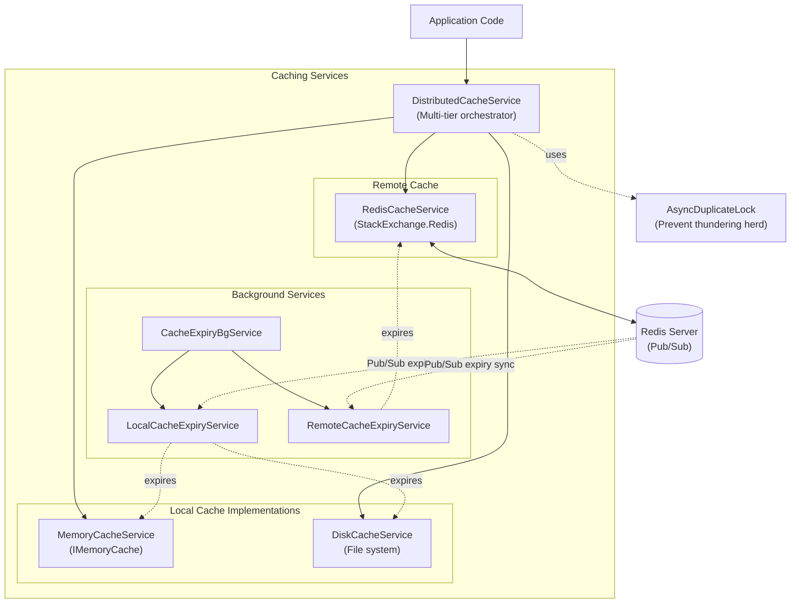

# CasCap.Common.Caching

Multi-tier distributed caching library implementing the cache-aside pattern with support for Memory, Disk, and Redis cache layers.

## Purpose

Provides a complete caching infrastructure with local (in-process) and remote (Redis) cache tiers, synchronised expiration via Redis Pub/Sub, and configurable serialization (JSON or MessagePack). Includes background services for cache expiry management and an async duplicate-lock mechanism to prevent thundering-herd scenarios.

**Target frameworks:** `netstandard2.0`, `net8.0`, `net9.0`, `net10.0`

### Services

| Service | Description |
| --- | --- |
| `DistributedCacheService` | Multi-tier cache orchestrator — reads from local first, falls back to Redis, and populates both tiers on miss |
| `RedisCacheService` | `IRemoteCache` implementation wrapping StackExchange.Redis with optional Lua script support |
| `MemoryCacheService` | `ILocalCache` implementation backed by `IMemoryCache` |
| `DiskCacheService` | `ILocalCache` implementation persisting cache entries to disk |
| `CacheExpiryBgService` | Background service coordinating expiry synchronisation between local and remote caches |
| `LocalCacheExpiryService` | Handles local cache entry expiration |
| `RemoteCacheExpiryService` | Handles remote cache entry expiration |

### Extensions

| Extension | Description |
| --- | --- |
| `ServiceCollectionExtensions.AddCasCapCaching()` | Registers all caching services into the DI container |
| `CachingExtensions` | Helper methods for cache key formatting and serialization |
| `AsyncDuplicateLock` | Prevents duplicate concurrent cache population for the same key |

### Configuration

| Type | Description |
| --- | --- |
| `CachingConfig` | Main configuration record — `PubSubPrefix`, `MemoryCacheSizeLimit`, `UseBuiltInLuaScripts`, `DiskCacheFolder`, `ExpirationSyncMode` |
| `CacheParameters` | Per-layer cache configuration (TTL, size limits) |

### Enums

| Enum | Values |
| --- | --- |
| `CacheType` | `None`, `Memory`, `Disk`, `Redis` |
| `SerializationType` | `None`, `Json`, `MessagePack` |
| `ExpirationSyncType` | `None`, `ExpireViaPubSub`, `ExtendRemoteExpiry` |

## Service Architecture

Multi-tier caching infrastructure with cache-aside pattern:

## Dependencies

### NuGet Packages

| Package |
| --- |
| [Microsoft.Extensions.Caching.Memory](https://www.nuget.org/packages/microsoft.extensions.caching.memory) |
| [Microsoft.Extensions.Configuration.Json](https://www.nuget.org/packages/microsoft.extensions.configuration.json) |
| [Microsoft.Extensions.Options.ConfigurationExtensions](https://www.nuget.org/packages/microsoft.extensions.options.configurationextensions) |
| [Microsoft.Extensions.Options.DataAnnotations](https://www.nuget.org/packages/microsoft.extensions.options.dataannotations) |
| [StackExchange.Redis](https://www.nuget.org/packages/stackexchange.redis) |

### Project References

| Project | Purpose |
| --- | --- |
| `CasCap.Common.Abstractions` | `ILocalCache`, `IAppConfig` contracts |
| `CasCap.Common.Extensions` | General-purpose helper utilities |
| `CasCap.Common.Serialization.Json` | JSON serialization for cache values |
| `CasCap.Common.Serialization.MessagePack` | MessagePack serialization for cache values |
| `CasCap.Common.Logging` | `ApplicationLogging` static logger factory |
