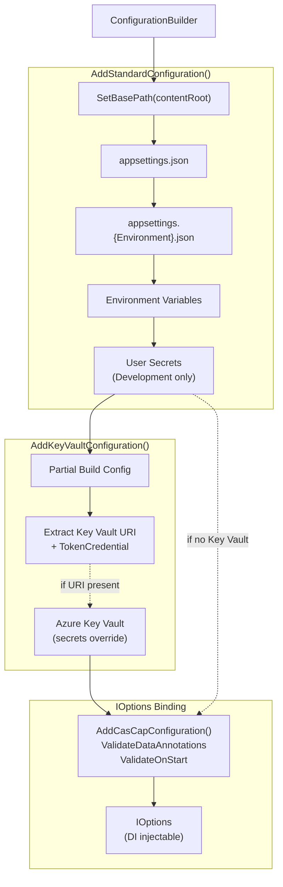

# CasCap.Common.Configuration

Configuration bootstrapping helpers for .NET applications — standard `IConfiguration` pipeline setup, Azure Key Vault integration, and validated `IOptions<T>` binding for `IAppConfig` records.

## Purpose

Provides a standardised way to build the configuration pipeline (appsettings.json, environment overrides, environment variables, user secrets, Azure Key Vault) and to bind configuration sections to `IAppConfig` record types with DataAnnotations validation on startup.

**Target frameworks:** `netstandard2.0`, `net8.0`, `net9.0`, `net10.0`

### Extensions

| Class | Key Methods |
| --- | --- |
| `ConfigurationBuilderExtensions` | `AddStandardConfiguration()` — sets base path, registers `appsettings.json`, `appsettings.{env}.json`, environment variables, and optional user secrets |
|  | `AddKeyVaultConfiguration()` — conditionally adds Azure Key Vault (skips silently when URI or credential is `null`) |
|  | `AddKeyVaultConfigurationFrom()` — partial-builds configuration, extracts Key Vault credentials via delegate, then adds Key Vault |
| `ConfigurationServiceCollectionExtensions` | `AddCasCapConfiguration<TConfig>()` — binds a configuration section to an `IAppConfig` record with `ValidateDataAnnotations` and `ValidateOnStart` |

## Usage

```csharp
var configuration = new ConfigurationBuilder()
    .AddStandardConfiguration(environmentName, Assembly.GetExecutingAssembly())
    .AddKeyVaultConfigurationFrom(cfg =>
    {
        var appConfig = cfg.GetSection(AppConfig.ConfigurationSectionName).Get<AppConfig>();
        return (appConfig?.KeyVaultUri, appConfig?.TokenCredential);
    })
    .Build();
```

## Configuration Hierarchy

Configuration bootstrapping flow with layered sources:



**Layering Priority** (later sources override earlier ones):

1. `appsettings.json`
2. `appsettings.{Environment}.json`
3. Environment Variables
4. User Secrets (Development only)
5. Azure Key Vault (if configured)

## Dependencies

### NuGet Packages

| Package | Purpose |
| --- | --- |
| `Azure.Extensions.AspNetCore.Configuration.Secrets` | Azure Key Vault configuration provider |
| `Microsoft.Extensions.Configuration.EnvironmentVariables` | Environment variable configuration source |
| `Microsoft.Extensions.Configuration.FileExtensions` | File-based configuration helpers (`SetBasePath`) |
| `Microsoft.Extensions.Configuration.Json` | JSON file configuration source |
| `Microsoft.Extensions.Configuration.UserSecrets` | User secrets configuration source |
| `Microsoft.Extensions.Options.ConfigurationExtensions` | `IOptions<T>` binding to `IConfiguration` |
| `Microsoft.Extensions.Options.DataAnnotations` | `ValidateDataAnnotations` / `ValidateOnStart` |

### Project References

| Project | Purpose |
| --- | --- |
| `CasCap.Common.Abstractions` | `IAppConfig` contract used as a generic constraint |
| `CasCap.Common.Logging` | `ApplicationLogging` static logger factory |
