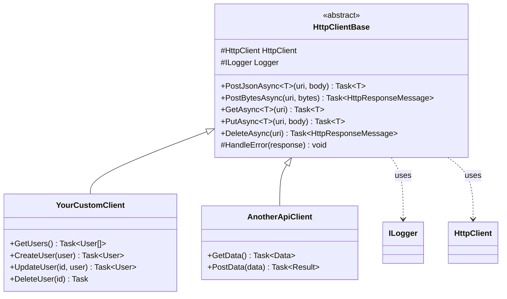

# CasCap.Common.Net

Abstract base class and extensions for building typed `HttpClient` wrappers with built-in JSON serialization and error handling.

## Purpose

Provides `HttpClientBase`, an abstract class giving derived HTTP clients a consistent surface for `GET`, `POST`, `PUT`, and `DELETE` operations with automatic JSON (de)serialization. Network-related extension methods for headers and query strings are also included. The `HttpClientBase` implementation is gated behind `#if NET8_0_OR_GREATER`.

**Target frameworks:** `netstandard2.0`, `net8.0`, `net9.0`, `net10.0`

### Services

| Type | Description |
| --- | --- |
| `HttpClientBase` | Abstract base class — `PostJsonAsync`, `PostBytesAsync`, `GetAsync`, `PutAsync`, `DeleteAsync` with error handling |

### Extensions

| Class | Key Methods |
| --- | --- |
| `NetExtensions` | `HttpResponseHeaders.TryGetValue()`, `ToQueryString()`, `AddOrOverwrite()` |
| `HttpClientBuilderResilienceExtensions` | `AddStandardResilience()` — adds retry, circuit breaker, and timeout via `Microsoft.Extensions.Http.Resilience` with structured logging |

## Class Hierarchy

Abstract base class pattern for typed HTTP clients:

**Usage Pattern:**

1. Inherit from `HttpClientBase`
2. Inject `HttpClient` and `ILogger` via constructor
3. Use built-in methods (`GetAsync`, `PostJsonAsync`, etc.) for API calls
4. Override `HandleError` for custom error handling

## Dependencies

### NuGet Packages

| Package | Purpose |
| --- | --- |
| `Microsoft.Extensions.Http.Resilience` | Standard resilience handler (retry, circuit breaker, timeout) for `IHttpClientBuilder` (net8.0+ only) |

### Project References

| Project | Purpose |
| --- | --- |
| `CasCap.Common.Serialization.Json` | JSON serialization for request/response bodies |
| `CasCap.Common.Logging` | `ApplicationLogging` static logger factory |
