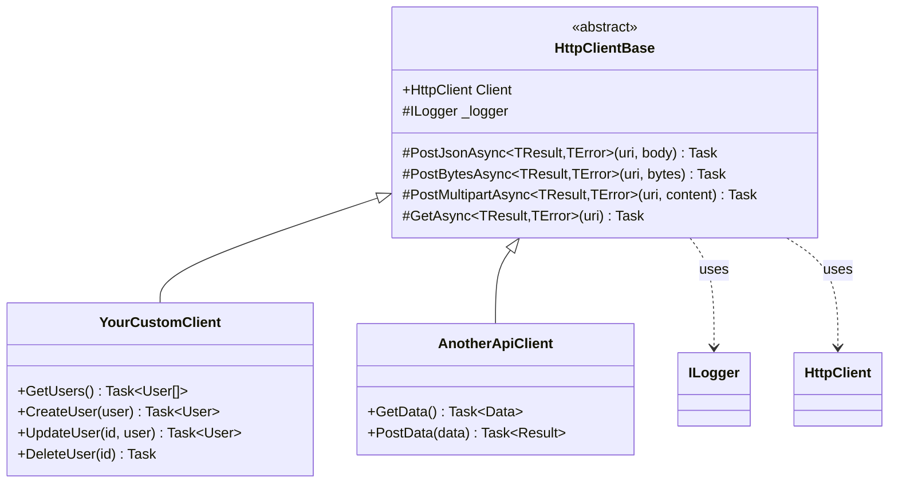

# CasCap.Common.Net

Abstract base class, extensions, and authentication handlers for building typed `HttpClient` wrappers and securing ASP.NET Core APIs.

## Installation

```bash
dotnet add package CasCap.Common.Net
```

## Purpose

Provides `HttpClientBase`, an abstract class giving derived HTTP clients a consistent surface for `GET` and `POST` operations — JSON, binary and multipart — with automatic (de)serialization and centralised failure logging. Network-related extension methods for headers and query strings are also included. Additionally provides `BasicAuthenticationHandler` for HTTP Basic authentication against `ApiAuthConfig`. The `HttpClientBase` and `BasicAuthenticationHandler` implementations are gated behind `#if NET8_0_OR_GREATER`.

**Target frameworks:** `netstandard2.0`, `net8.0`, `net9.0`, `net10.0`

### Services

| Type | Description |
| --- | --- |
| `HttpClientBase` | Abstract base class — `PostJsonAsync`, `PostJson`, `PostBytesAsync`, `PostBytes`, `PostMultipartAsync`, `PostMultipart`, `GetAsync`, `Get` with error handling (net8.0+ only) |

Every method takes a `TResult` and a `TError` type. `string` returns the raw body and `byte[]` returns
the raw bytes, so an endpoint answering with audio or any other binary payload needs no separate
plumbing; anything else is deserialized as JSON.

The caller owns the `MultipartFormDataContent` passed to the multipart methods and should dispose it,
which also disposes the parts added to it.

### Models

| Type | Description |
| --- | --- |
| `HttpRetrySafety` | Which requests a resilience pipeline may retry — `SafeMethodsOnly` (default), `AllMethods`, `Never`. Declared in namespace `CasCap.Common.Models` |

### Authentication

| Type | Description |
| --- | --- |
| `BasicAuthenticationHandler` | ASP.NET Core authentication handler validating HTTP Basic credentials against `ApiAuthConfig`. Skips authentication for paths matching `ApiAuthConfig.AnonymousPathPrefixes` (net8.0+ only) |

### HTTP Auditing

| Type | Description |
| --- | --- |
| `HttpAuditHandler` | `DelegatingHandler` that captures HTTP request/response pairs and persists them via `IHttpAuditStore` (net8.0+ only) |
| `HttpAuditSource` | Defines the `HttpRequestOptionsKey` used to tag requests with a logical source name |
| `FileHttpAuditStore` | Lightweight file-based `IHttpAuditStore` that writes each audit entry as an individual JSON file organised into daily sub-folders (`yyyy-MM-dd`) |

### Extensions

| Class | Key Methods |
| --- | --- |
| `NetExtensions` | `HttpResponseHeaders.TryGetValue()`, `ToQueryString()`, `AddOrOverwrite()` |
| `HttpClientBuilderResilienceExtensions` | `AddStandardResilience(callerName, retrySafety)` — adds retry, circuit breaker, and timeout via `Microsoft.Extensions.Http.Resilience` with structured logging. `IsReplaySafe()` exposes the per-request decision |
| `HttpClientBuilderAuditExtensions` | `AddHttpAuditing(sourceName)` — adds `HttpAuditHandler` to the HTTP client pipeline to capture request/response audit entries (net8.0+ only) |

### Retry Safety

`AddStandardResilience` defaults to `HttpRetrySafety.SafeMethodsOnly`. Idempotent methods retry
normally; a POST or PATCH is retried only when the request provably never reached the server, because
a timeout or a 5xx says nothing about whether it was already processed. Replaying one then applies its
side effect twice.

Pass `HttpRetrySafety.AllMethods` only where the endpoint is genuinely idempotent — for example
because it accepts an idempotency key:

```csharp
using CasCap.Common.Models;

services.AddHttpClient<MyClient>()
    .AddStandardResilience(nameof(MyClient), HttpRetrySafety.AllMethods);
```

## Class Hierarchy

Abstract base class pattern for typed HTTP clients:


```mermaid
classDiagram
    direction TB

    HttpClientBase <|-- YourCustomClient
    HttpClientBase <|-- AnotherApiClient

    class HttpClientBase {
        <<abstract>>
        +HttpClient Client
        #ILogger _logger
        #PostJsonAsync~TResult,TError~(uri, body) Task
        #PostBytesAsync~TResult,TError~(uri, bytes) Task
        #PostMultipartAsync~TResult,TError~(uri, content) Task
        #GetAsync~TResult,TError~(uri) Task
    }

    class YourCustomClient {
        +GetUsers() Task~User[]~
        +CreateUser(user) Task~User~
        +UpdateUser(id, user) Task~User~
        +DeleteUser(id) Task
    }

    class AnotherApiClient {
        +GetData() Task~Data~
        +PostData(data) Task~Result~
    }

    HttpClientBase ..> ILogger : uses
    HttpClientBase ..> HttpClient : uses
```

**Usage Pattern:**

1. Inherit from `HttpClientBase`
2. Inject `HttpClient` and `ILogger` via constructor
3. Use built-in methods (`GetAsync`, `PostJsonAsync`, etc.) for API calls
4. Override `HandleError` for custom error handling

## Dependencies

### NuGet Packages

| Package | Purpose |
| --- | --- |
| `Microsoft.Extensions.Http.Resilience` | Standard resilience handler (retry, circuit breaker, timeout) for `IHttpClientBuilder` (net8.0+ only) |

### Project References

| Project | Purpose |
| --- | --- |
| `CasCap.Common.Abstractions` | `ApiAuthConfig` and `IAppConfig` abstractions |
| `CasCap.Common.Serialization.Json` | JSON serialization for request/response bodies |
| `CasCap.Common.Logging` | `ApplicationLogging` static logger factory |
